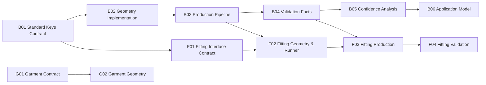

<!-- GENERATED — DO NOT EDIT MANUALLY -->
<!-- This file is rendered by tools/render_dashboard_v0.py -->
<!-- Manual edits will be overwritten on next render cycle. -->
<!-- To change plan/structure: edit docs/ops/dashboard/PLAN_v0.yaml -->
<!-- To change data sources: edit docs/ops/dashboard/LAB_SOURCES_v0.yaml -->

# 프로젝트 대시보드

<!-- PRESERVE:USER_NOTES:BEGIN -->
(여기에 메모를 입력하세요.)
<!-- PRESERVE:USER_NOTES:END -->

**마일스톤**: M01_baseline
**렌더 시각**: 2026-01-30T16:35:25Z

---

## 데이터 소스

| 소스 | 경로 | 상태 |
|--------|------|--------|
| 계획 (SSoT) | `docs/ops/dashboard/PLAN_v0.yaml` | 로드됨 |
| 랩 소스 | `docs/ops/dashboard/LAB_SOURCES_v0.yaml` | 로드됨 |
| 내보내기 계약 | `docs/ops/dashboard/EXPORT_CONTRACT_v0.md` | 참조 |
| hub (body) log | `C:/Users/caino/Desktop/AI_model/exports/progress/PROGRESS_LOG.jsonl` | 로드됨 |
| fitting_lab (fitting) log | `C:/Users/caino/Desktop/fitting_lab/exports/progress/PROGRESS_LOG.jsonl` | 로드됨 |
| garment_lab (garment) log | `C:/Users/caino/Desktop/garment_lab/exports/progress/PROGRESS_LOG.jsonl` | 로드됨 |

---

## 단계 × 모듈 매트릭스

| 단계 | 바디 | 피팅 | 가먼트 |
|-------|------|---------|---------|
| **P01** Contract & Data Foundation | B01: 3/3 | F01: 0/3 | G01: 0/2 |
| **P02** Geometry & Measurement | B02: 1/3 B03: 0/3 | F02: 0/2 | G02: 0/2 |
| **P03** Validation & Confidence | B04: 0/3 B05: 0/2 | F03: 0/2 F04: 0/2 | — |
| **P04** Application | B06: 0/2 | — | — |

> 셀 형식: `<step_id>: <done>/<total>`

---

## 모듈 진행

### 바디

| 스텝 | 이름 | 계층 | 완료 | 전체 | 진행률 | 언락 |
|------|------|-------|------|-------|----------|---------|
| B01 | Standard Keys Contract | L1 | 3 | 3 | 100% | body:B02, fitting:F01 |
| B02 | Geometry Implementation | L2 | 1 | 3 | 33% | body:B03 |
| B03 | Production Pipeline | L3 | 0 | 3 | 0% | body:B04, fitting:F02 |
| B04 | Validation Facts | L4 | 0 | 3 | 0% | body:B05, fitting:F03 |
| B05 | Confidence Analysis | L5 | 0 | 2 | 0% | body:B06 |
| B06 | Application Model | L6 | 0 | 2 | 0% | — |
| **합계** | | | **4** | **16** | **25%** | |

### 피팅

| 스텝 | 이름 | 계층 | 완료 | 전체 | 진행률 | 언락 |
|------|------|-------|------|-------|----------|---------|
| F01 | Fitting Interface Contract | L1 | 0 | 3 | 0% | fitting:F02 |
| F02 | Fitting Geometry & Runner | L2 | 0 | 2 | 0% | fitting:F03 |
| F03 | Fitting Production | L3 | 0 | 2 | 0% | fitting:F04 |
| F04 | Fitting Validation | L4 | 0 | 2 | 0% | — |
| **합계** | | | **0** | **9** | **0%** | |

### 가먼트

| 스텝 | 이름 | 계층 | 완료 | 전체 | 진행률 | 언락 |
|------|------|-------|------|-------|----------|---------|
| G01 | Garment Contract | L1 | 0 | 2 | 0% | garment:G02 |
| G02 | Garment Geometry | L2 | 0 | 2 | 0% | — |
| **합계** | | | **0** | **4** | **0%** | |

---

## 언락 상태

| 스텝 | 의존 | 언락 상태 |
|------|------------|---------------|
| B01 | (none) | UNLOCKED |
| B02 | body:B01 | UNLOCKED |
| B03 | body:B02 | BLOCKED |
| B04 | body:B03 | BLOCKED |
| B05 | body:B04 | BLOCKED |
| B06 | body:B05 | BLOCKED |
| F01 | body:B01 | UNLOCKED |
| F02 | fitting:F01, body:B03 | BLOCKED |
| F03 | fitting:F02, body:B04 | BLOCKED |
| F04 | fitting:F03 | BLOCKED |
| G01 | (none) | UNLOCKED |
| G02 | garment:G01 | BLOCKED |

> UNLOCKED = 모든 의존 완료. BLOCKED = 미완료 의존 1개 이상.

---

## 가용 작업 (UNLOCKED, 잔여 > 0)

| 스텝 | 모듈 | 이름 | 완료 | 전체 | 잔여 | 언락 |
|------|--------|------|------|-------|-----------|---------|
| B02 | body | Geometry Implementation | 1 | 3 | 2 | body:B03 |
| F01 | fitting | Fitting Interface Contract | 0 | 3 | 3 | fitting:F02 |
| G01 | garment | Garment Contract | 0 | 2 | 2 | garment:G02 |

> 가용 = UNLOCKED이며 완료 < 전체

---

## 다음 언락 대상 (BLOCKED, 미완료 의존 정확히 1개)

| 스텝 | 모듈 | 이름 | 차단 의존 | 차단 완료/전체 |
|------|--------|------|---------------------|---------------------|
| B03 | body | Production Pipeline | B02 | 1/3 |
| B04 | body | Validation Facts | B03 | 0/3 |
| B05 | body | Confidence Analysis | B04 | 0/3 |
| B06 | body | Application Model | B05 | 0/2 |
| F04 | fitting | Fitting Validation | F03 | 0/2 |
| G02 | garment | Garment Geometry | G01 | 0/2 |

> 다음 언락 = BLOCKED이며 미완료 의존 1개

---

## 최근 이벤트

| # | 타임스탬프 | 랩 | 모듈 | 스텝 | 델타 | 증거 수 | 증거 샘플 | 비고 |
|---|-----------|-----|--------|------|-------|----------------|-----------------|------|
| 1 | 2026-01-29T18:46:20.111017+09:00 | hub | body | B02 | 1 | 1 | specs/common/geometry_manifest.schema.json | geometry schema defined |
| 2 | 2026-01-29T18:46:11.140769+09:00 | hub | body | B01 | 1 | 1 | contract/sizekorea_v2.json | contract JSON |
| 3 | 2026-01-29T18:45:57.808415+09:00 | hub | body | B01 | 2 | 2 | docs/contract/standard_keys.md | standard keys + unit standard documented |

> 최근 이벤트 최대 20건 표시. 전체 기록은 각 랩 PROGRESS_LOG.jsonl 참조.

---

## 의존성 그래프 (Mermaid, 선택)

> 위 표가 기본 뷰. Mermaid는 보조용.
